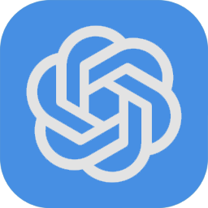
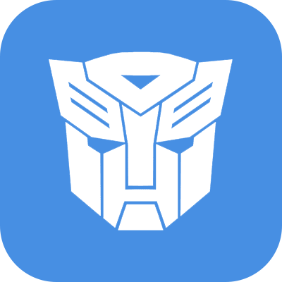

# What?

**Plump GPT** fattens your thoughts.

(It's a Chat UI for interacting with language model APIs).

- Frontend: [Svelte](https://svelte.dev/)
- Backend: [SvelteKit](https://kit.svelte.dev/)
- Database: [Pocketbase](https://pocketbase.io/)

It runs in your browser on `localhost:1337`.


# Models

**Open AI**
- &nbsp; GPT-4.1 nano
- &nbsp; GPT-4.1 mini
- &nbsp; GPT-4.1
- &nbsp; o3-mini

**Anthropic**
- &nbsp; Claude 3.5 Haiku
- &nbsp; Claude 3.7 Sonnet
- &nbsp; Claude 3 Opus

**Google**
- &nbsp; Gemini 2.0 Flash Lite
- &nbsp; Gemini 2.0 Flash
- &nbsp; Gemini 2.0 Flash Thinking
- &nbsp; Gemini 2.5 Pro

**X**
- &nbsp; Grok 3 Mini
- &nbsp; Grok 3

**Cohere**
- &nbsp; Command-R
- &nbsp; Command-R+

**Meta**
- &nbsp; Llama 4 Scout
- &nbsp; Llama 4 Maverick
- &nbsp; Llama 3.1 405b

**Nous**
- &nbsp; Nous Hermes 3 405b

**Stealth**
- &nbsp; Quasar Alpha
- &nbsp; Optimus Alpha

**Mistral**
- &nbsp; Mistral Small
- &nbsp; Mistral Large

**AI21 Labs**
- &nbsp; Jamba 1.6 Mini
- &nbsp; Jamba 1.6 Large

**Qwen**
- &nbsp; Qwen 2.5 Turbo
- &nbsp; Qwen 2.5 Plus
- &nbsp; Qwen 2.5 Max

**DeepSeek**
- &nbsp; DeepSeek V3 (Chat)
- &nbsp; DeepSeek R1 (Reasoner)


# Why?

- 🤖 **All models**
    - Switch freely between models + providers
    - Send the same prompt to multiple models
    - Switch models mid-chat, e.g. start with `gpt-4o-mini` then switch to `Claude 3.5 Sonnet`
- 📐 **Forks**
    - Branched conversations
    - No-one had done this, and I needed it, so I did it
    - Should be a fundamental feature of any LLM interface, imo
- 📝 **System prompt**
    - Full control of the `system_prompt`
    - Store multiple prompts in the db and switch easily
- 🔧 **Model settings**
    - Set `temperature`, `top_p`, etc.
- 🚀 **Quick launch**
    - Start a new chat 'from anywhere' via a keyboard launcher (e.g. [Alfred](https://www.alfredapp.com/) on MacOS)
    - Model + prompt are passed via URL query parameters, `http://localhost:1337/?model=gpt-4o&prompt=wake+up+gpt`
    - No-one had done this either, and I needed it
- 🔍 **Chat history**
    - Browse + search your past conversations
- 💰 **Usage**
    - See input + output token counts
    - See cache read + write (where the API provides prompt caching)
    - See total cost
    - _^^ All of the above a) for each message, b) for whole conversation_
- 💵 **API pricing**
    - Pay as you go = much cheaper than all the various subscriptions


# Install

1. Download the latest [Pocketbase release](https://pocketbase.io/docs/)
    - Put the `pocketbase` executable in the `/pocketbase/` folder
    - Run `pocketbase` for the first time to initialise it
        - On MacOS you may need to do `⌘+Click` -> `Open` -> `Confirm open`
    - Close the terminal window once it's done

2. Create a `.env` file in the root directory (or rename the `.env.example` file to `.env`), add `OPENAI_API_KEY=<your_key_goes_here>` and save:
```
OPENAI_API_KEY=sk-YoUrOpEnAiAcCeSsToKeNtHaTyOuGeTfRoMtHeIrWeBsItE
ANTHROPIC_API_KEY=...
GEMINI_API_KEY=...
GROK_API_KEY=...
COHERE_API_KEY=...
MISTRAL_API_KEY=...
OPENROUTER_API_KEY=...
DEEPSEEK_API_KEY=...
```

3. Install dependencies
```
npm install
```

4. Compile the SvelteKit app:
```
npm run build
```

5. Launch both Pocketbase and Plump GPT with the shell script:
```
./start.sh
```
   - (Note: You can also run Plump GPT in dev mode, with live reloading, by running `./start.sh dev`)


6. Go to `http://localhost:1336/_/` (⌘+click the link) and add an admin email + password to finish setting up Pocketbase

7. Go to `http://localhost:1337` and start chatting.


# Customise

- Change `/static/img/avatar.png` to your own avatar

_(Tip: You can use `git update-index --assume-unchanged static/img/avatar.png` to ignore the change if you're developing)._


# Note

This isn't production ready code - it's a personal project that I originally had no intention of sharing. I use Plump GPT a lot, and I could probably be persuaded to develop it properly, but it works for my needs and I'm currently focused on other things!
